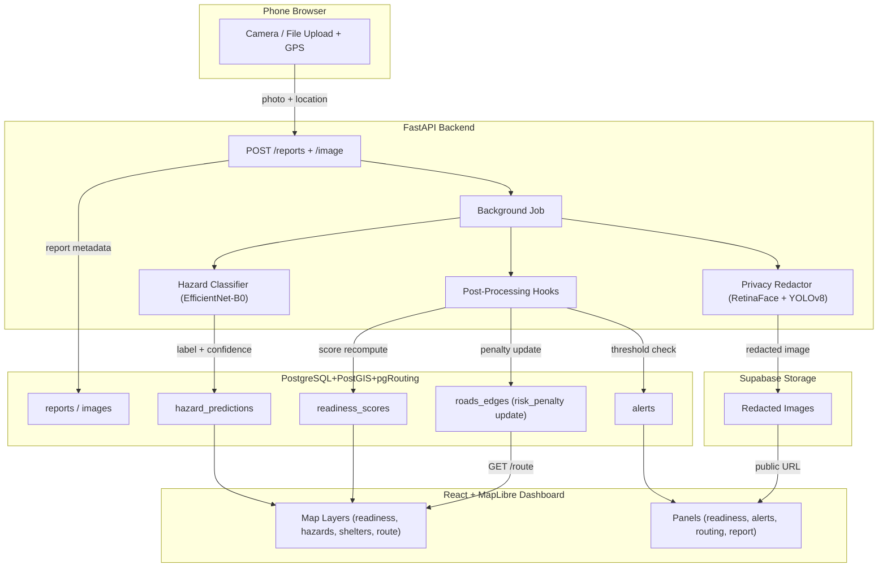
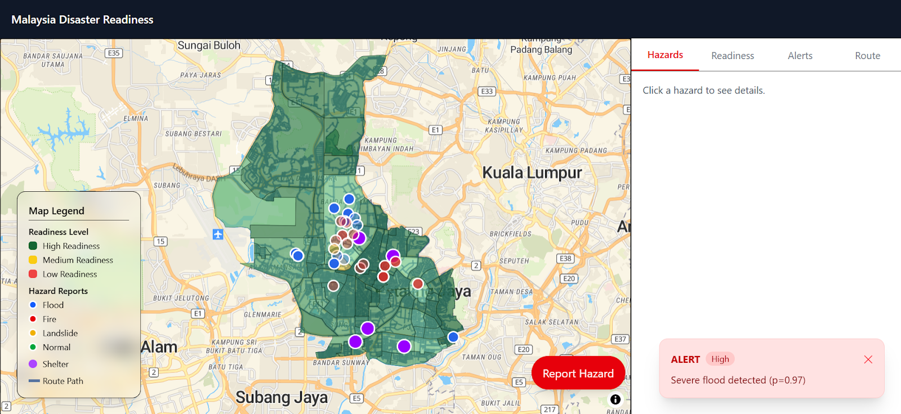
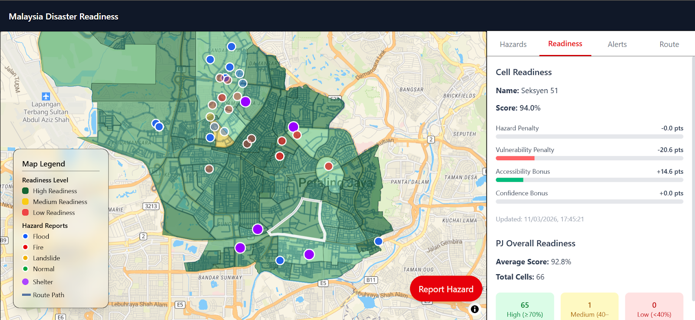
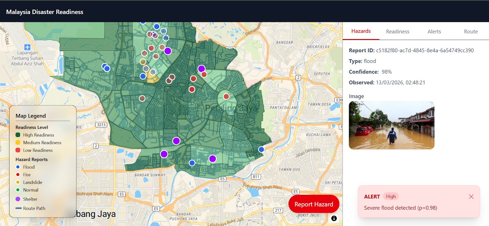

# Hyperlocal Disaster Readiness with Community Sensing (Malaysia)

An AI based disaster readiness web application for Malaysia that lets users submit hazard photos and locations from a mobile browser, then uses hazard classification, privacy redaction, dynamic routing, and a readiness score engine to generate safer evacuation routes and real time alerts.

> **MVP study area:** Petaling Jaya, Selangor, chosen for its mix of urban density, known flood-prone zones, and OSM road data availability.

---

## Features

- **Community hazard reporting** — submit photos and GPS location from any phone browser (camera, file upload, or pin-drop fallback)
- **AI hazard classification** — EfficientNet-B0 classifies scenes into flood, fire, landslide, or normal (with confidence scores)
- **Privacy redaction** — RetinaFace face detection + YOLOv8 license plate detection with Gaussian blur before storage or display
- **Dynamic evacuation routing** — pgRouting, using Dijkstra/A* algorithm, computes micro-routes that reroute around newly hazardous roads
- **Readiness scoring** — transparent 0 to 100 score per neighborhood with breakdown (vulnerability, hazard penalty, accessibility, data confidence)
- **Real-time alerts** — auto-generated when readiness scores cross defined thresholds
- **Risk imputation** — XGBoost baseline vulnerability model using elevation, slope, river proximity, hotspot distance, road density, and travel time
- **Responsible AI** — confidence thresholds, model versioning, redacted-only image storage, temporary retention, consent flow

---

## Architecture



---

## Internal Layers

The system is organized into clearly separated layers:

| Layer | Responsibility | Key Directory |
| --- | --- | --- |
| **Frontend** | Interactive map, report submission, panels | [`apps/frontend/`](apps/frontend/README.md) |
| **API** | REST endpoints, validation, orchestration, rate limiting | [`apps/api/`](apps/api/README.md) |
| **Services** | Business logic, image processing, routing adapter, weather | `apps/api/src/app/services/` |
| **Repositories** | Data access layer (SQLAlchemy ORM) | `apps/api/src/app/repositories/` |
| **Database** | PostGIS schema, migrations, spatial functions, RLS | [`supabase/`](supabase/README.md) |
| **Routing Engine** | pgRouting SQL, graph prep, penalty updates, accessibility | [`routing/`](routing/README.md) |
| **AI / ML** | Classification, redaction, imputation pipelines | [`ai/`](#ai-modules) |
| **Tests** | API, AI, routing, integration, E2E test suites | `tests/` |

---

## Tech Stack

| Category | Technology |
| --- | --- |
| **Frontend** | React (Vite), MapLibre GL JS, Vanilla CSS |
| **Backend** | Python FastAPI, Pydantic, Uvicorn |
| **Database** | PostgreSQL + PostGIS + pgRouting (via Supabase) |
| **AI — Classification** | EfficientNet-B0 (PyTorch) |
| **AI — Redaction** | RetinaFace (face), YOLOv8 (license plate) |
| **AI — Imputation** | XGBoost regressor |
| **Storage** | Supabase Storage (redacted images only) |
| **Environment** | Poetry (Python deps), npm (frontend deps) |
| **Containerization** | Docker Compose (API + optional frontend) |
| **Deployment** | Vercel (frontend), DigitalOcean (API), Supabase (DB/storage) |

---

## API Endpoints

All endpoints are prefixed with `/api/v1`. Full endpoint details in [`apps/api/README.md`](apps/api/README.md).

| Method | Path | Description |
| --- | --- | --- |
| `GET` | `/health` | Health check |
| `GET` | `/api/v1/info` | API metadata |
| `POST` | `/api/v1/reports` | Create hazard report metadata |
| `POST` | `/api/v1/reports/{id}/image` | Upload image (triggers classification + redaction) |
| `GET` | `/api/v1/reports/{id}/status` | Report processing status |
| `GET` | `/api/v1/hazards` | List hazard predictions for map layer |
| `GET` | `/api/v1/readiness` | List neighborhood readiness scores (0 to 100) |
| `GET` | `/api/v1/alerts` | List active alerts |
| `GET` | `/api/v1/route` | Compute evacuation route via pgRouting |
| `GET` | `/api/v1/weather` | Current weather snapshot |

Interactive API docs: `http://localhost:8000/docs`

---

## Getting Started

### Prerequisites

- Python 3.11+ (managed via [Poetry](https://python-poetry.org/))
- Node.js 18+ and npm
- Docker (optional, for containerized running)
- Supabase CLI (for database management)
- A Supabase project with PostGIS and pgRouting enabled

### 1. Clone and configure

```bash
git clone https://github.com/deettoh/disaster-readiness.git && cd disaster-readiness
cp .env.example .env
# Edit .env with your DATABASE_URL, Supabase keys, etc.
```

### 2. Install dependencies

```bash
# Python (API + image processing + AI)
poetry install

# Frontend
cd apps/frontend && npm install && cd ../..
```

### 3. Seed the database

A sequence of commands must be run in order from the project root:

See [`routing/README.md`](routing/README.md) for detailed routing setup and [`supabase/README.md`](supabase/README.md) for database details.

### 4. Run the application

#### Without Docker

```bash
# Terminal 1: Start API
poetry run uvicorn app.main:app --host 0.0.0.0 --port 8000 --app-dir apps/api/src

# Terminal 2: Start frontend
cd apps/frontend && npm run dev
```

#### With Docker

```bash
# Backend only
docker compose up --build

# Full stack (API + frontend)
docker compose --profile frontend up --build
```

See [`DOCKER.md`](DOCKER.md) for the full container runbook.

---

## Project Structure

```text
disaster-readiness/
├── ai/
│   ├── classification/     # Hazard image classification model
│   ├── imputation/         # Risk/vulnerability imputation model
│   └── redaction/          # Face + plate privacy redaction
├── apps/
│   ├── api/                # FastAPI backend service
│   └── frontend/           # React + MapLibre web app
├── assets/                # Screenshots of prototype UI
├── data/                   # External, processed, and sample datasets
├── docs/                # Project report and demo video
├── routing/                # pgRouting SQL, graph prep, accessibility
├── supabase/               # Migrations, seeds, DB config
└── tests/                  # All test suites
```

---

## AI Modules

| Module | Model | Purpose | Details |
| --- | --- | --- | --- |
| **Classification** | EfficientNet-B0 (PyTorch) | Classify hazard type from uploaded image | [README](ai/classification/README.md) |
| **Redaction** | RetinaFace + YOLOv8 | Blur faces and license plates before storage | [README](ai/redaction/README.md) |
| **Imputation** | XGBoost Regressor | Predict baseline vulnerability per grid cell | [README](ai/imputation/README.md) |

---

## Screenshots

### Landing Page


### Readiness Panel


### Hazard Panel


Full screenshot gallery: [docs/screenshots/README.md](docs/screenshots/README.md)

---

## Deployment

| Service | Platform | Notes |
| --- | --- | --- |
| Frontend | Vercel | Static React build |
| API | Render | Single Docker container (API + image processing) |
| Database + Storage | Supabase | Managed PostgreSQL + PostGIS + pgRouting + Storage |

---

## Notes

- Poetry is initialized at repository root (`pyproject.toml`, `poetry.lock`, `.venv`).
- Report and demo video link can be found in [`docs/`](docs/README.md) |
